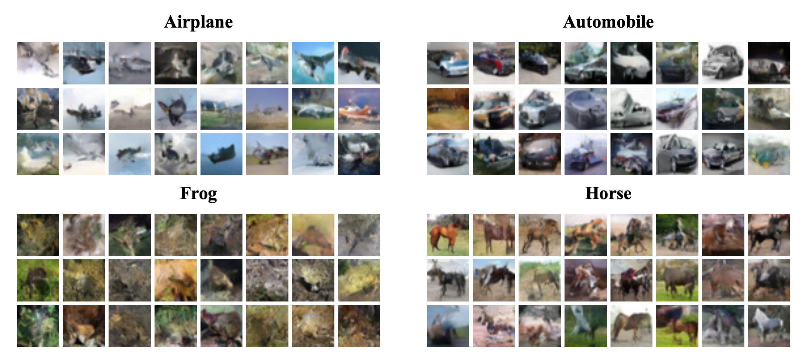
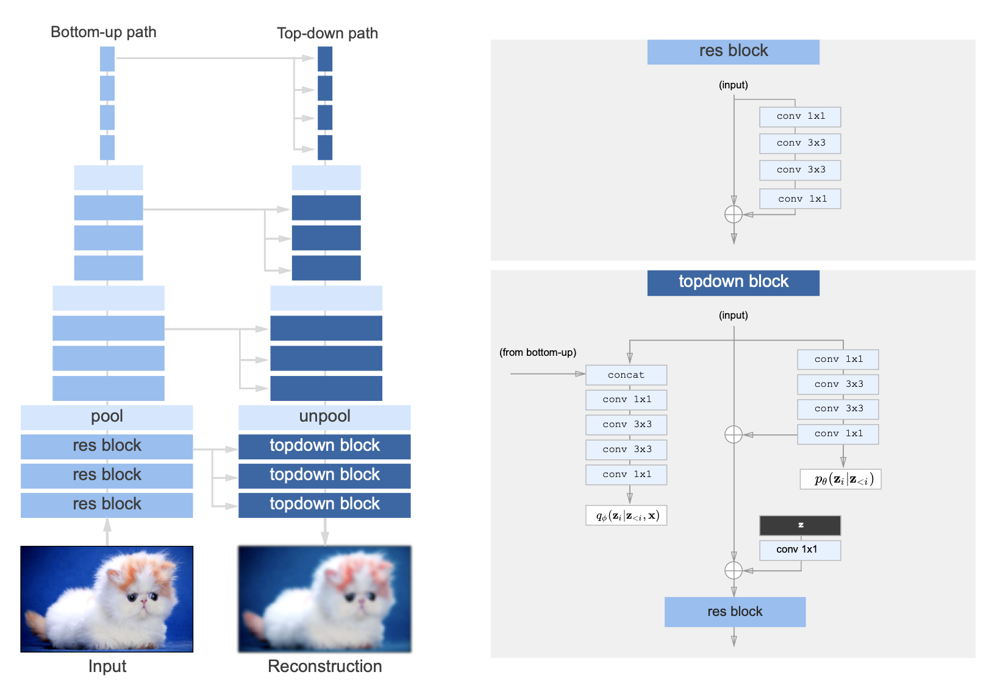

# Very Deep Conditional VAE



After reading [Rewon Child's paper on very deep variational autoencoders (VDVAE)](https://arxiv.org/abs/2011.10650), I felt inspired to see if I could make their model **conditional**. A conditional VAE (or CVAE) is similar to a regular VAE but includes a label during the forward pass. This allows the model to pick up on the correlation between a label and its corresponding image features, which ultimately allows for more fine-grained control over the model's generated samples. For instance, once a CVAE has been trained on the CIFAR-10 dataset, you can specify that you want "horse" or "airplane" samples from the model's learned distribution.

The VDVAE uses a hierarchical "top-down" architecture inspired by the work of Sønderby et al. on [ladder variational autoencoders](https://arxiv.org/abs/1602.02282). In short, this model first computes a "bottom-up" pass of the input image to generate features. Then, a "top-down" pass samples multiple latent variables at multiple resolutions conditioned on the features extracted in the "bottom-up" pass. For much more on this, I suggest you read [the paper](https://arxiv.org/abs/2011.10650).



In order to make the model conditional, we augment the architecture slightly by adding an embedding layer at the top of the decoder (the right part of the diagram). This embedding layer takes a one-hot encoded vector (representing the image's class) as input, which is then filtered down throughout the decoder in the "top-down" pass. When the model has been trained, we sample values by inputting into the decoder a one-hot vector representing the desired class, after which an image resembling this class should (hopefully) be sampled from the learned distribution.

Virtually all of the code in this repo is taken from the [original codebase](https://github.com/openai/vdvae) by Rewon Child and OpenAI. Much of the original code pertaining to benchmarking the model is not included. This repo simply contains the bare-bones implementation of the model and should hopefully run on your CUDA-enabled hardware. The results shown at the top of the page were sampled from a model trained on Google Colab for about a week. If you reduce the size of the model (see `H.enc_blocks` and `H.dec_blocks` in `train.py`), you should get faster training times. I have not tested how this affects the quality of the final samples, though.

To train the model, simply run the command

```
python3 train.py
```

If you wish to train on another dataset than CIFAR-10 (or if you wish to tweak the number of epochs, etc.), I encourage you to edit `train.py`.

If you wish to simply sample from a pretrained model, you can download the weights [here](https://drive.google.com/uc?id=1wQhCqtOgr3ypLypqlLNGxG8F7Jq5xj6c) (note that the file size is 325MB), move the file into the repo folder under the name `weights.pt`, and then run:

```
python3 sample.py
```

This will sample 10 images of each of the 10 classes represented in the CIFAR-10 dataset of 32x32 images. Enjoy!
